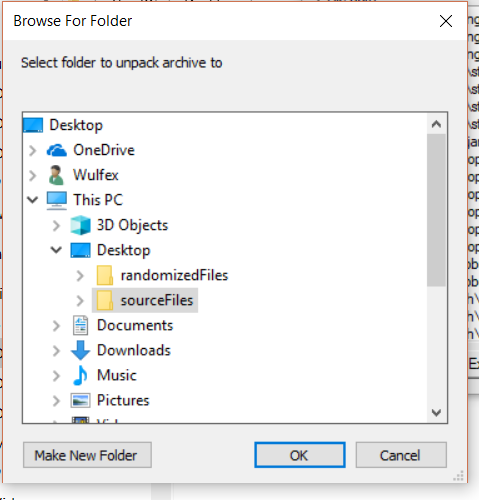
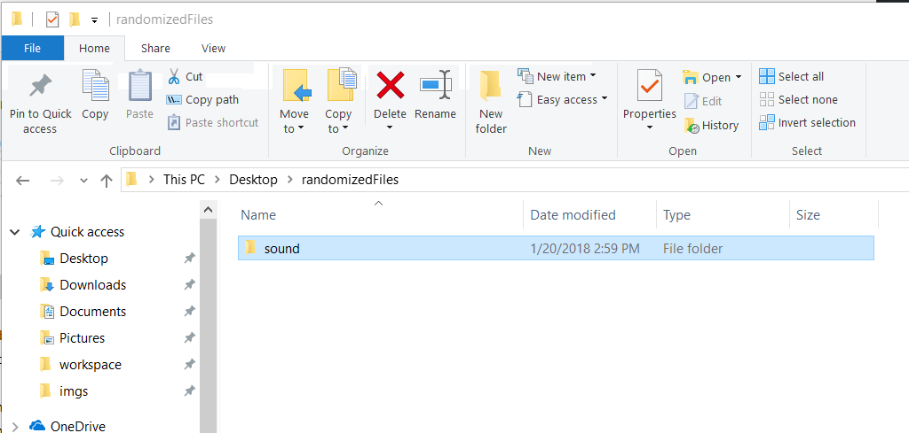
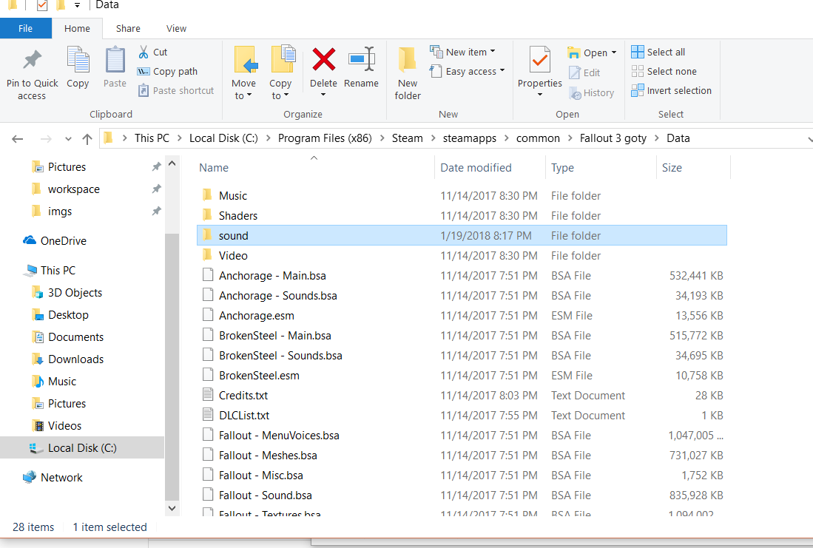

# How-To Guide

## Requirements
  + [BSARandomizer.jar](https://github.com/Wulfex/BSARandomizer/releases)
  + [Java Runtime 9.0.1 or higher](http://www.oracle.com/technetwork/java/javase/downloads/jre9-downloads-3848532.html)
  + [BSA Unpacker Utility](https://www.nexusmods.com/skyrim/mods/4804?tab=files)
  
## Create Your Source Files
  1. Launcher the BSA Unpacker
  1. Click the "Open" Button in the lower left
  1. Navigate to the location of the files you want to randomize, in this case the Fallout 3's Sounds Files
    
  1. Select the BSA you want to randomize and click "Open" 
  1. Once all the files are loaded click the "Extract All" button
  1. Navigate to the folder you want to store your source files, in this example "Desktop > sourceFiles"
    
  1. Give the application some time, it takes awhile to extract all the files and there is no indication of when the job is complete (this is not my program).
  1. After a couple of minutes, the extraction should be complete and you can close the BSA Unpacker
  1. Next, create a folder where all the randomized files will live, in this example "Desktop > randomizedFiles
  1. Once you have the source and destination folders setup, it's time to run the randomizer
  1. Open a Command Prompt as an administrator at your BSARandomizer.jar download location
  1. type "Java -jar BSARandomizer.jar <source folder filepath (i.e. C:\Users\<your user>\Desktop\sourceFiles)> <randomized folder filefpath (i.e C:\Users\<your user>\Desktop\sourceFiles>"
    or if you're following exactly Java -jar BSARandomizer.jar "C:\Users\Wulfex\Desktop\sourceFiles" "C:\Users\Wulfex\Desktop\randomizedFiles"
  1. Once that's done running, copy the internal folders back into the "Data" folder of your Bethesda Game
    
    ---
    
  1. Enjoy!
  
  Note: I used Fallout 3 in this example. If you want to mix all the DLC sound files, you can extract and copy all the .bsa files into your source file destination and run throught the same process. This should produce a folder(s) of exatly what you need.
  
